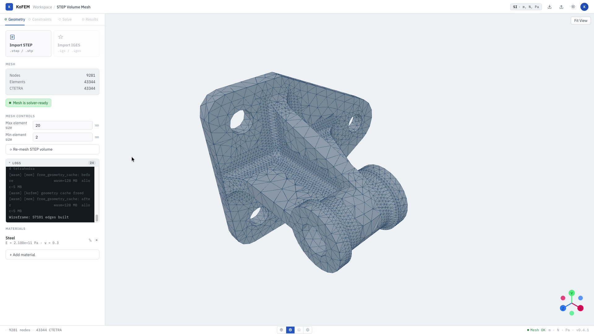

<p align="center">
  
</p>

<h1 align="center">KoFEM</h1>

<p align="center">
  Browser-first finite element analysis — import STEP geometry, mesh it, and run
  a linear-static solve entirely in your browser. No installation, no license server.
</p>

<p align="center">
  
</p>

KoFEM runs the full pipeline — **STEP geometry → OCCT tessellation → Netgen
volume mesh → MFEM FEM solve** — directly in the browser via a C++ engine
compiled to WebAssembly, with a React + Three.js frontend.

## Run it with Docker

The app is a static frontend (pre-built WASM engine + React UI) served by Nginx.
The compiled WASM engine is committed under `web/src/wasm/pkg/`, so **you don't
need Emscripten, Rust, or the C++ libraries — just Docker.** The container
listens on port **10000**.

### Option A — Pull the published image (recommended)

```bash
docker run ghcr.io/mkofler96/kofem-web:latest
```

### Option B — Build it yourself

```bash
# Build context is the web/ directory (Dockerfile lives at web/Dockerfile).
docker build -t kofem-web ./web
docker run kofem-web
```

## Development
To rebuild the WASM engine from C++ source first, run
`bash scripts/docker-build-wasm.sh` — it compiles the engine inside a Docker
container and regenerates `web/src/wasm/pkg/`. The committed engine is already
up to date, so this is only needed if you change the C++ sources.
Afterwards, the web frontend can be run by
```bash
cd web && bun install && bun run dev
```
> [!NOTE]
> The wasm docker build is layered on top of [KoFEM-Dependencies](https://github.com/mkofler96/KoFEM-Dependencies), which contains the precompiled wasm OCCT, Netgen and MFEM libraries. KoFEM can be compiled without docker using the script `scripts/build-wasm.sh`, but then the OCCT, Netgen and MFEM source code must be downloaded and will be compiled during the KoFEM compilation. This will take some time.