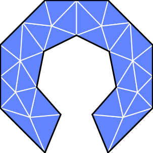

<p align="center">
  
</p>

<h1 align="center">KoFEM</h1>

KoFEM is Finite element analysis tool made to run in your browser, without installation and without sending data to any server or cloud. It runs the full pipeline — **STEP geometry → OCCT tessellation → Netgen
volume mesh → MFEM FEM solve** — directly in the browser via a C++ engine
compiled to WebAssembly, with a React + Three.js frontend. The software can be launched from the official website [kofem.org](https://kofem.org/) or run locally via docker.

## Run it with Docker

The app is a static frontend (pre-built WASM engine + React UI) served by Nginx.
The compiled WASM engine is committed under `web/src/wasm/pkg/`, so **you don't
need Emscripten, Rust, or the C++ libraries — just Docker.** The container
listens on port **10000**.

Option A — Pull the published image (recommended)

```bash
docker run ghcr.io/mkofler96/kofem-web:latest
```

Option B — Build it yourself

```bash
# Build context is the web/ directory (Dockerfile lives at web/Dockerfile).
docker build -t kofem-web ./web
docker run kofem-web
```

## Development

To rebuild the WASM engine from C++ source first, run
`bash scripts/docker-build-wasm.sh` — it compiles the engine inside a Docker
container and regenerates `web/src/wasm/pkg/`. The committed engine is already
up to date, so this is only needed if you change the C++ sources.
Afterwards, the web frontend can be run by

```bash
cd web && bun install && bun run dev
```

> [!NOTE]
> The wasm docker build is layered on top of [KoFEM-Dependencies](https://github.com/mkofler96/KoFEM-Dependencies), which contains the precompiled wasm OCCT, Netgen and MFEM libraries. KoFEM can be compiled without docker using the script `scripts/build-wasm.sh`, but then the OCCT, Netgen and MFEM source code must be downloaded and will be compiled during the KoFEM compilation. This will take some time.

## Disclaimer

KoFEM is research-grade software provided for education and exploration. It is
**not** a certified engineering tool. Finite element results are approximations
and may be wrong; **no result should be relied upon without independent
verification** by a qualified engineer. The authors accept **no liability** for
any real-world failure, damage, or loss arising from use of this software or its
output. See [DISCLAIMER.md](DISCLAIMER.md) for the full text. By using KoFEM you
accept these terms.

## License

KoFEM is free and open-source software, licensed under the
**[GNU Affero General Public License v3.0 or later](LICENSE)** (AGPL-3.0-or-later).

KoFEM builds on third-party libraries — **OpenCASCADE** (LGPL-2.1 with an
exception), **Netgen** (LGPL-2.1), and **MFEM** (BSD-3-Clause) — each retaining
its own license. See [THIRD-PARTY-LICENSES.md](THIRD-PARTY-LICENSES.md) for the
full attribution and compatibility notes.

## Funding
If you enjoyed what I built, consider [buying me a coffee ☕](buymeacoffee.com/mkofler). Thanks for your support! 