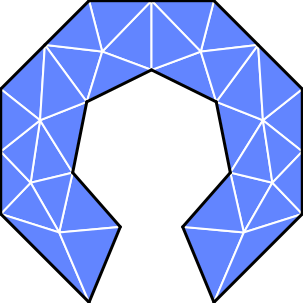
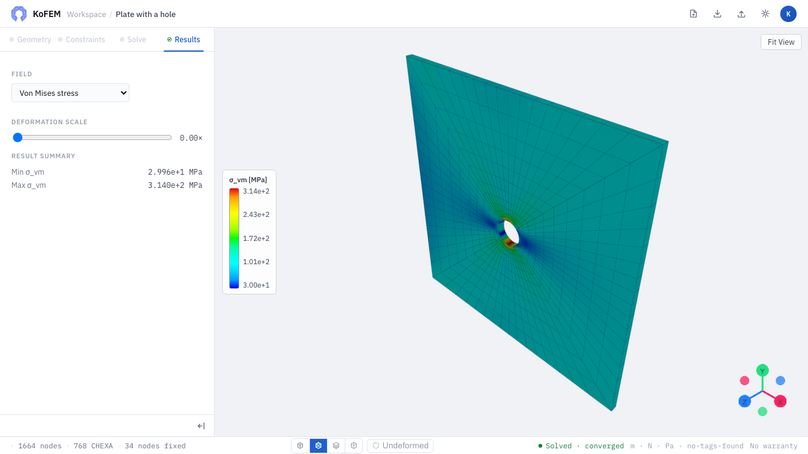
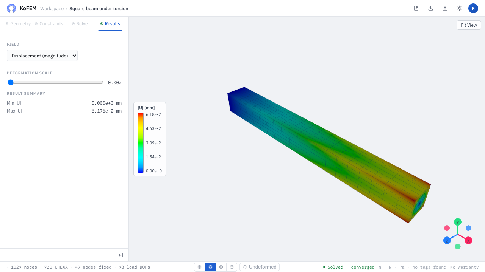

<p align="center">
  
</p>

<h1 align="center">KoFEM</h1>

KoFEM is Finite element analysis tool made to run in your browser, without installation and without sending data to any server or cloud. It runs the full pipeline — **STEP geometry → OCCT tessellation → Netgen
volume mesh → MFEM FEM solve** — directly in the browser via a C++ engine
compiled to WebAssembly, with a React + Three.js frontend. Thin-walled bodies
take a shell path instead of tetrahedra, and assemblies can mix the two. The software can be launched from the official website [kofem.org](https://kofem.org/) or run locally via docker.

## Features

- **CAD import** — STEP and IGES, single parts as well as multibody assemblies.
- **Meshing** — Netgen tetrahedral meshing straight from the CAD topology. The
  default element size is derived from the imported geometry rather than a fixed
  number, so a 1 mm cube and a 1 m bracket both come out sensibly meshed.
- **Shells** — thin-walled bodies are detected at mesh time from their wall
  thickness, collapsed to a mid-surface `CTRIA3` mesh and solved with Kirchhoff /
  DKT plate elements. The detection can be switched off, its thickness ratio
  tuned, and the element type (shell or solid) set per body.
- **Multibody assemblies** — one material per body, bonded ties between bodies,
  and explicit **RBE3** coupling at shell-to-solid interfaces. Mixed
  `CTRIA3` + `CTETRA` models are solved by the coupled solver.
- **Surface-to-point couplings** — a picked surface is idealised to a single
  reference point, so a bolt, bearing or pin acts through the one point it acts
  through instead of being smeared over the nodes of a hole. Both
  **distributing (RBE3)** and **kinematic (RBE2)** kinds, the latter with a
  selectable DOF mask.
- **Boundary conditions and loads** — pick faces, edges or nodes in the viewport;
  fix DOFs or prescribe non-zero displacements (solid and shell alike), and apply
  forces, moments or pressures to a selection.
- **Solve** — linear-elastic small-displacement analysis with MFEM: a solid path,
  a pure-shell path, and a coupled shell/solid path.
- **Results** — displacement magnitude, `Ux`/`Uy`/`Uz` and von Mises stress on the
  deformed shape, with a scalable deformation and a colorbar whose limits can be
  clamped by hand to compare load cases on one scale.
- **Save and share** — the complete analysis (mesh, materials, BCs, loads,
  results, view state) is stored in a single `.vtu` file that also opens directly
  in ParaView, VisIt or meshio.

## Examples



Click here to view this example on KoFEM web [Plate with Hole](https://kofem.org/app/?example=plate-with-hole)


Click here to view this example on KoFEM web [Beam Torsion](https://kofem.org/app/?example=beam-torsion)

The gallery also carries the shell and multibody cases:
[Plate with a hole — shells](https://kofem.org/app/?example=plate-with-hole-shell)
solves the same plate with Kirchhoff shell elements, and
[Crane hook — coupled shell + solid](https://kofem.org/app/?example=crane-hook-shell)
is a three-body assembly with per-body materials, a shell-idealised holder, and
the pin tied into the hook's bore by an RBE3 coupling.

For more examples visit [KoFEM Examples](https://kofem.org/examples/)

## Run it with Docker

The app is a static frontend (pre-built WASM engine + React UI) served by Nginx.
The compiled WASM engine is downloaded as a prebuilt binary, so **you don't need
Emscripten, Rust, or the C++ libraries — just Docker.** The container listens on
port **10000**.

Option A — Pull the published image (recommended)

```bash
docker run ghcr.io/mkofler96/kofem-web:latest
```

Option B — Build it yourself

```bash
# Fetch the prebuilt engine into web/src/wasm/pkg/ (see Development below).
bash scripts/fetch-wasm-engine.sh

# Build context is the web/ directory (Dockerfile lives at web/Dockerfile).
docker build -t kofem-web ./web
docker run kofem-web
```

## Development

```bash
cd web && bun install && bun run dev
```

That is all you need — the compiled engine (~34 MB) is a build output, so it is
published as a GitHub Release rather than committed, and `bun run dev`, `build`
and `test` download the one matching your checkout via
`scripts/fetch-wasm-engine.sh`. You can also run that script directly.

To change the engine you do need the C++ toolchain. `bash scripts/docker-build-wasm.sh`
compiles it inside a Docker container and writes `web/src/wasm/pkg/` itself; from
then on the fetch step sees your local build and leaves it alone. CI publishes the
release for your sources once they land on `main`.

> [!NOTE]
> The wasm docker build is layered on top of [KoFEM-Dependencies](https://github.com/mkofler96/KoFEM-Dependencies), which contains the precompiled wasm OCCT, Netgen and MFEM libraries. KoFEM can be compiled without docker using the script `scripts/build-wasm.sh`, but then the OCCT, Netgen and MFEM source code must be downloaded and will be compiled during the KoFEM compilation. This will take some time.

## Disclaimer

KoFEM is research-grade software provided for education and exploration. It is
**not** a certified engineering tool. Finite element results are approximations
and may be wrong; **no result should be relied upon without independent
verification** by a qualified engineer. The authors accept **no liability** for
any real-world failure, damage, or loss arising from use of this software or its
output. See [DISCLAIMER.md](DISCLAIMER.md) for the full text. By using KoFEM you
accept these terms.

## License

KoFEM is free and open-source software, licensed under the
**[GNU Affero General Public License v3.0 or later](LICENSE)** (AGPL-3.0-or-later).

KoFEM builds on third-party libraries — **OpenCASCADE** (LGPL-2.1 with an
exception), **Netgen** (LGPL-2.1), and **MFEM** (BSD-3-Clause) — each retaining
its own license. See [THIRD-PARTY-LICENSES.md](THIRD-PARTY-LICENSES.md) for the
full attribution and compatibility notes.

## Funding

If you enjoyed what I built, consider [buying me a coffee ☕](https://buymeacoffee.com/mkofler). Thanks for your support!
