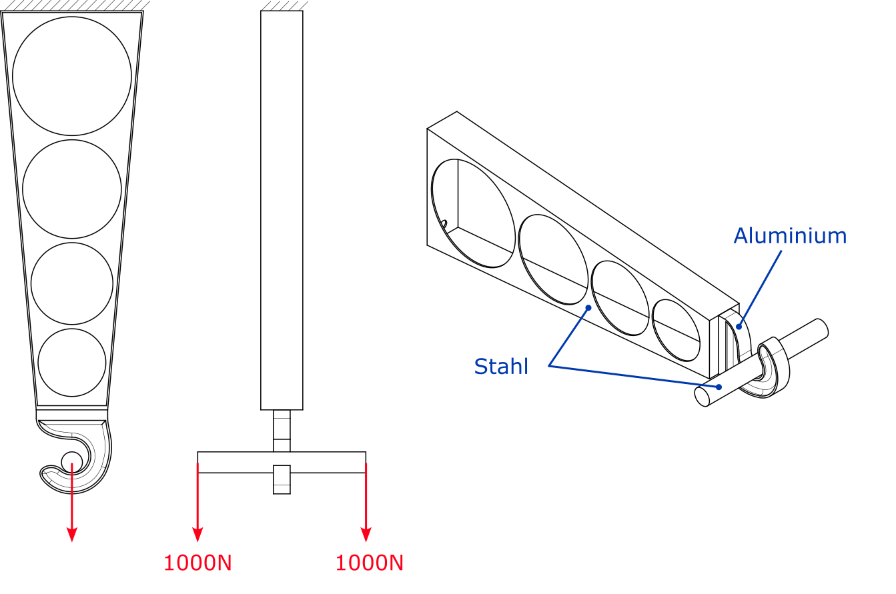

<!--
SPDX-FileCopyrightText: 2026 Michael Kofler
SPDX-License-Identifier: AGPL-3.0-or-later
-->

# Web gallery examples

Generators for the analyses shipped in `web/public/examples/`. Each writes a
`.vtu` plus its entry in `examples.json`; `generate.mjs` runs them all.

## The crane hook load case

`generate-crane-shell.mjs` builds the coupled shell + solid analysis from
`test_files/full-crane-hook.step`. The STEP holds three bodies:

| body | part | how it is modelled | material |
| ---- | ---- | ------------------ | -------- |
| 1 | holder — the tapered channel carrying the four lightening holes | thin walls (0.5 mm) collapsed to a shell mid-surface; the base block stays solid | steel |
| 2 | hook — the curl at the lower end | solid tets | aluminium |
| 3 | cylinder — the pin through the hook's bore | solid tets, tied to the bore by RBE3 across the fit clearance | steel |

Boundary conditions, matching the reference drawing:

- **Clamped**: CAD face 7, the holder's top cap (y = 260, 50 × 170 mm) — all
  six DOF.
- **Loaded**: 1000 N in −Y on **each** end disc of the cylinder — CAD faces 66
  (x = +75) and 67 (x = −125), 472 mm² each. **2 kN in total.** `LOAD_FACES` in
  the generator holds the PER-FACE vector, and so does the `.vtu` load group's
  `totalForce` field, because `rebuildSurfaceLoads` applies a group's components
  once per face entry.

_(Load-case drawing supplied with the external reference run — clamp hatched at
the holder's top, 1000 N at each cylinder end, materials called out per body.)_

### Per-body materials

`mat.solid` handed to `solve_coupled` is an ARRAY, selected per tet by
`mesh.attributes` (1-based), so the aluminium hook and the steel holder solve
together. The shell side stays a single material: a solve idealises exactly one
body as shells (#376), and here that body is the steel holder.

This is why it had to be added. `solve_coupled` used to read one solid material,
and `solve_linear_elastic` — which has taken a material array since #353 — does
not converge on models containing these 0.5 mm walls, running the full
5000-iteration Gauss-Seidel PCG cap on both the assembly and the holder alone,
the latter stalling at a relative residual of 8e-3. Per-body materials and
"solves at all" used to be mutually exclusive for this model.

### The 6 mm example is NOT mesh-converged

An OptiStruct run of the same load case reports max |u| = 0.5482 mm. The shipped
6 mm model gives 0.2690 mm. That gap is mostly mesh, not physics — the answer is
still climbing at 1.5 mm elements.

Refinement study, both models per size, materials as above. `F·u` is the
compliance (twice the strain energy) — the measure to read, since max |u| is a
point value at the cylinder end and noisier:

| h [mm] | coupled max \|u\| | coupled F·u | all-solid max \|u\| | all-solid F·u |
| ------ | ----------------- | ----------- | ------------------ | ------------- |
| 10 | 0.2873 | 439.60 | 0.2834 | 426.37 |
| 8 | 0.2498 | 437.27 | 0.2461 | 426.28 |
| 6 | 0.2690 | 439.22 | 0.2643 | 432.59 |
| 4 | 0.2501 | 439.74 | 0.2486 | 437.62 |
| 3 | 0.2508 | 439.73 | 0.2502 | 438.54 |
| 2.5 | 0.3653 | 493.69 | 0.4078 | 494.18 |
| 2 | 0.3623 | 500.14 | 0.4231 | 502.45 |
| 1.5 | 0.3806 | 512.52 | 0.4620 | 516.03 |

The flat run from 10 mm to 3 mm is **not** convergence. At 8, 6 and 4 mm the
0.5 mm wall carries ONE linear tet through its thickness (surface node layers at
x = −50.000 and −49.500 with nothing between), and one linear tet cannot bend, so
the holder is locked solid. Netgen's `min_element_size` is `h/10`, so
through-thickness resolution only improves as h falls; past 3 mm the lock
releases and the holder softens. Its displacement goes 0.0846 → 0.1876 mm
between 3 mm and 2 mm while the hook's and cylinder's own contributions move 5 %.

Nothing else moves across the sweep: holder volume varies 0.2 %, four walls are
detected at every size with thickness exactly 0.5000, and the 2 mm mesh has no
slivers (worst tet quality 8.5e-2, same as 3 mm).

At 1.5 mm the all-solid model is at 0.4620 mm against the reference's 0.5482 mm
— 1.19×, down from 2.19× at 3 mm — and still rising. Whatever remains is
smaller than the discretisation error at the sizes anyone would actually run.

Ruled out as causes of the residual gap:

- **The shell idealisation.** Compliance tracks the all-solid model to 0.7 % at
  every size from 2.5 mm down (493.7/494.2, 500.1/502.5, 512.5/516.0), for 3–5×
  fewer CG iterations. The comparison is only meaningful below 3 mm, though —
  above it the all-solid reference is locked, so the two agreeing there is the
  shell model matching a locked model, not two converged answers.
- **The holder/hook connection.** In the all-solid model that interface is
  conformal shared nodes with no tie of any kind, and the answer does not move.
- **Load direction.** −Y gives 0.191 mm, −Z 3.976 mm, −X 6.916 mm (all-steel at
  6 mm); the reference's contour bands run perpendicular to the arm and bunch
  toward the narrow end, which is what axial tension of a tapering section
  looks like.

Still open: **max |u| diverges between the two models even where compliance
agrees** — 0.3806 vs 0.4620 at 1.5 mm, a 21 % spread on a 0.7 % compliance
match. The maximum sits at the cylinder's outboard end, and the two models
derive different cylinder↔bore ties (809 couplings vs 185 at 1.5 mm, because
the coupled model's median tet edge excludes the wall tets). A local tie
difference is the obvious suspect; it does not affect the energy.
